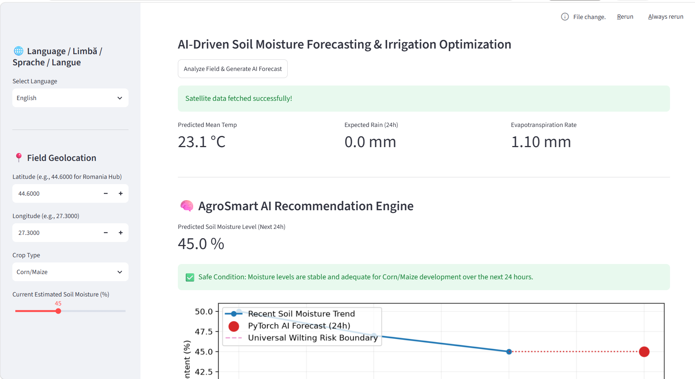

# 🇪🇺 AgroSmart-Predict: European Edition



**AgroSmart-Predict** is an AI-driven Software-as-a-Service (SaaS) prototype designed to combat global water scarcity and optimize crop yields through precision agriculture. By combining localized satellite meteorological telemetry with deep learning, the system provides accurate 24-hour soil moisture forecasts and actionable irrigation recommendations without requiring expensive physical in-ground sensors.

---

## 🚀 Core Features

- **Multi-Region European Telemetry:** Implements localized climate tracking across critical European agricultural hubs (Temperate, Mediterranean, Oceanic, and Humid Continental).
- **Satellite Data Ingestion Pipeline:** Queries the Open-Meteo API using sub-daily hourly data and resamples features dynamically via Pandas.
- **Deep Learning Core:** Uses a multi-layer PyTorch Neural Network (MLP) trained on real-world European climate variations with an impressive **Validation MAE of ~1.67%**.
- **Actionable Agronomic Decisions:** Translates AI forecasting percentages into precise volume targets (Liters / m²) customized for different crop types (e.g., Corn, Wheat).
- **Clean Architecture & Multi-Language UI:** Features an asynchronous, state-driven dashboard built in Streamlit, completely decoupled into modular layers and supporting English, Română, Deutsch, and Français.

---

## 🛠️ Technology Stack

- **User Interface:** Streamlit
- **Deep Learning Core:** PyTorch (`torch`, `torch.nn`)
- **Data Engineering:** Pandas, NumPy, Scikit-Learn
- **API & Networking:** Requests
- **Visualization:** Matplotlib

---

## 📁 Repository Structure

```text
AGROSMART_Project/
│
├── src/                  # Application source code
│   ├── data_processor.py # Data ingestion & Pandas resampling pipeline
│   ├── network_arch.py   # PyTorch Multi-Layer Perceptron architecture
│   ├── train_model.py    # Training execution pipeline & PyTorch loop
│   ├── weather_api.py    # Real-time satellite telemetry mapping layer
│   ├── plots.py          # Matplotlib visualization rendering tools
│   ├── translations.py   # Complete European i18n dictionary matrix
│   └── models/           # Stored ML assets (soil_predictor.pth & scaler.pkl)
│
├── data/                 # Training dataset footprint cache
├── app.py                # Main Streamlit web dashboard entrypoint
├── requirements.txt      # Project environment dependencies
└── .gitignore            # Version control exclusions map
```

---

## 💻 Quick Start & Execution Sequence

### 1. Environment Setup
Clone the repository and install all required system packages inside a Python 3.12 environment:
```bash
pip install -r requirements.txt
```

### 2. Ingest Satellite Telemetry
Download real-world multi-region historical weather data and execute the hydrological simulation:
```bash
python src/data_processor.py
```

### 3. Train the PyTorch AI Core
Train the neural network model on your CPU and store the compiled weights and transformers:
```bash
python src/train_model.py
```

### 4. Launch the Dashboard
Fire up the responsive Streamlit server locally:
```bash
streamlit run app.py
```
Open your browser at `http://localhost:8501` to use the multi-lingual application.
